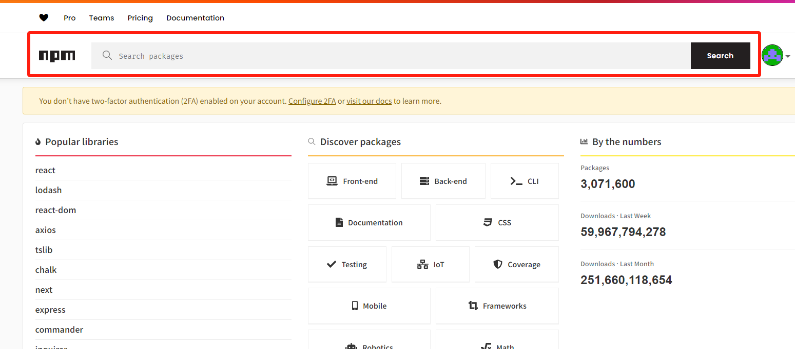
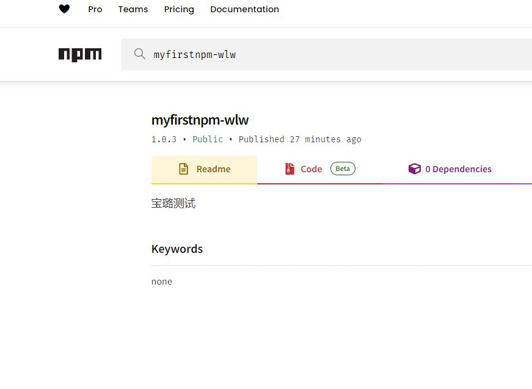
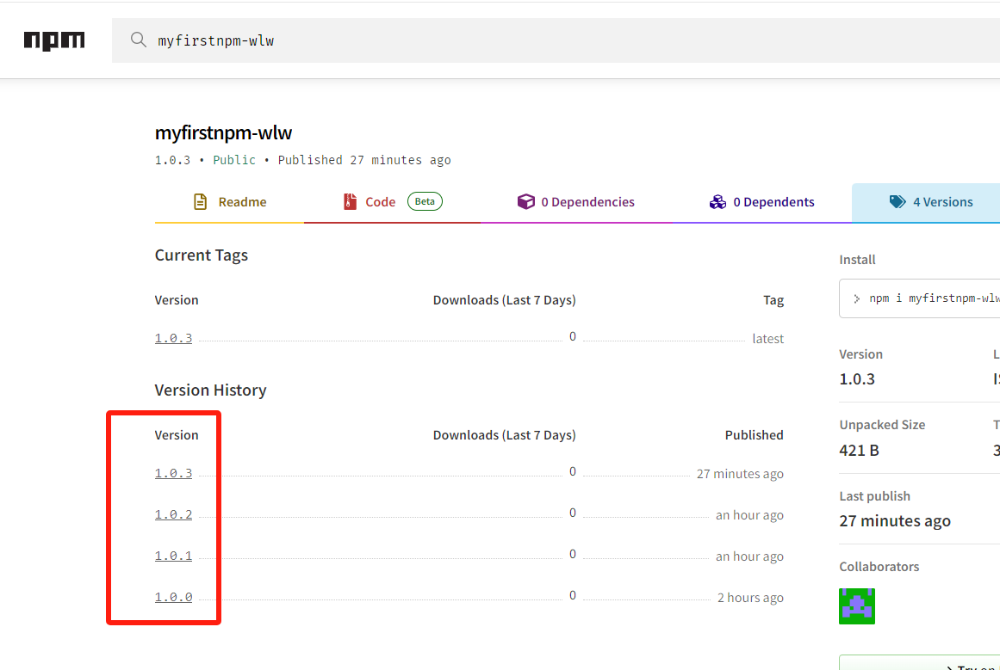

此为基本使用，后续会按照真实项目进行完善！

# 创建
## 初始化项目
新建一个文件夹，并在该文件夹运行cmd命令
``` javascript
npm init 
// 按照提示输入项目信息，完成后可以在package.json查看

{
  "name": "my_npmname", //发布的包名，不能是已经存在的包
  "version": "1.0.0",
  "description": "",
  "main": "index.js",
  "scripts": {
    "test": "echo \"Error: no test specified\" && exit 1"
  },
  "keywords": [],
  "author": "你的名字",
  "license": "ISC"
}
```
### 如何判断包名是否可使用？
可在官网[npm | Home](https://www.npmjs.com/)输入你想取的包名进行搜索，如果能搜索到完全匹配的包，说明这个包名已经被使用，请更换，如果执意不更换包名，那么在上传时会报错。

PS：在npm init阶段，项目名可以任意编辑，后续直接在package.json的name字段更改包名即可

## 编辑内容
根据npm包的功能进行代码编写
简单案例：声明一个函数并暴露
新建一个index.js
```javascript
function Hello() {
    console.log("Hello World!");
}

exports = {
    Hello
};
```

# 上传
## 上传源
检查npm源是否是默认地址  http://registry.npmjs.org
``` javascript
// 检查npm源地址
npm get registry

// 设置npm源地址 PS: 最好先把自己之前的地址保存起来，后续好换回来
npm set registry http://registry.npmjs.org
```

## NPM账户
上传npm包需要登录到npm，如果没有账户，请到这里注册 [npm | Home](https://www.npmjs.com/)
``` javascript
npm login // 按照提示输入用户名，密码，邮箱以及验证码
```

## 上传NPM包
``` javascript
npm publish
```
### 检查npm包是否上传成功
进入npm官网[npm | Home](https://www.npmjs.com/)，直接搜索你自己的npm包名，如果能搜索到，那么就是上传成功了。


## 上传私有包
``` javascript
npm publish --access=restricted
```
# 更新
如果是多人合作的包，确保当前代码是最新的！！！！

## 版本号规则
xxx@x.y.z
xxx: 包名
x: 主版本 major 不兼容的API修改
y: 此版本 minor 向下兼容的新功能
z: 修订号 patch 向下兼容的问题修正

## 更新指令
npm包第一次上传默认是1.0.0，执行以下对应的更新指令，所对应的数字会自动+1
``` javascript
npm version patch // 更新修订号
npm version minor // 更新次版本
npm version major // 更新主版本
```

如：执行一次npm version patch后，版本号变成了 -> @1.0.1

## 重新上传
``` javascript
npm publish
```
版本更新后，需要重新上传到npm，直接运行npm publish，你的npm包会自动迭代

# 使用
和其他npm包 使用方法一样，在需要的项目中通过npm i下载依赖，并使用import导入。
